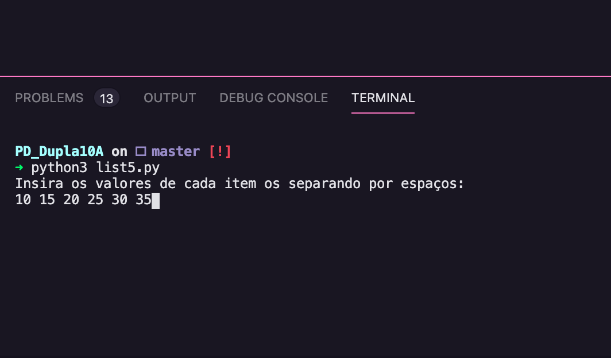
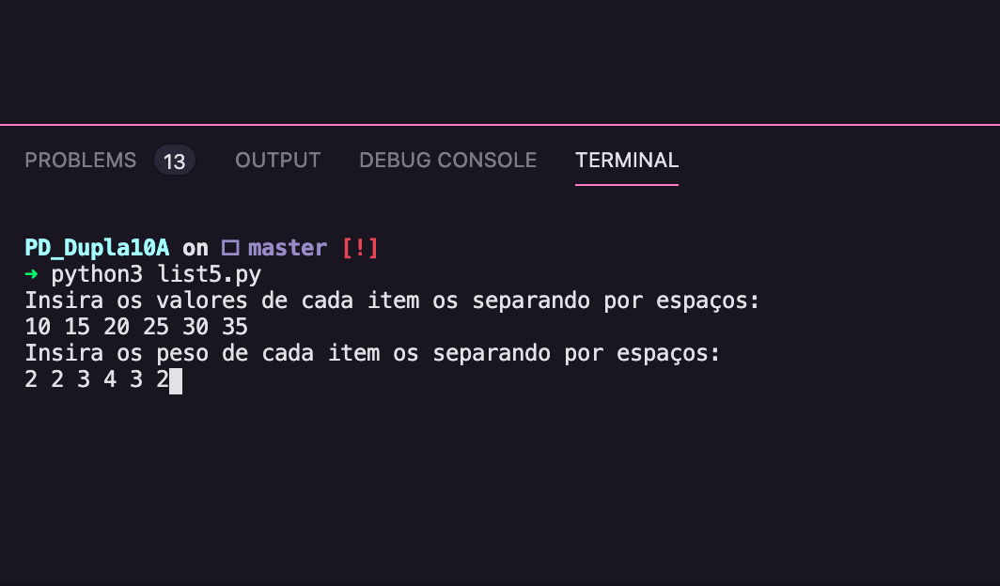
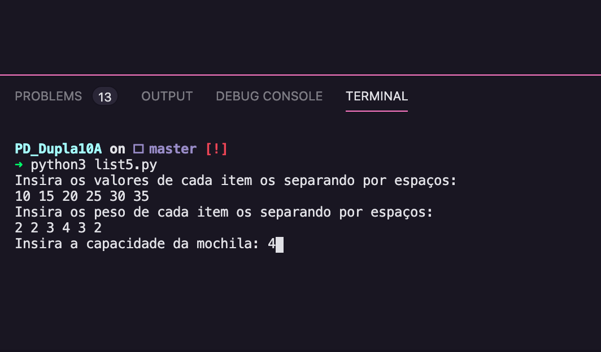
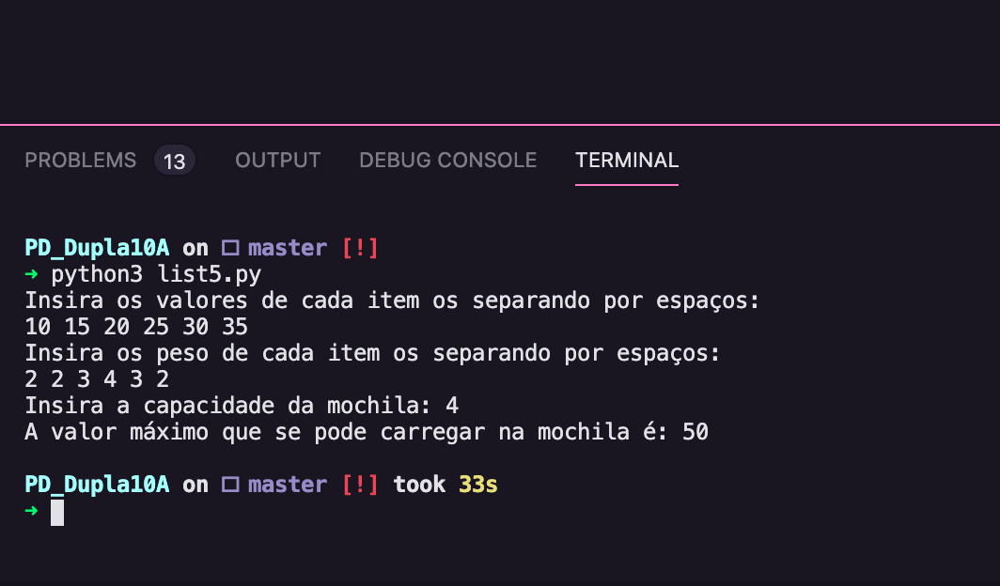

# Programação dinâmica

**Número da Lista**: 5<br>
**Conteúdo da Disciplina**: Programação Dinamica<br>
## Alunos
|Matrícula | Aluno |
| -- | -- |
| 17/0039668  |  Lucas Ganda Carvalho  |
| 17/0047326  |  Wictor Bastos Girardi |
## Sobre 
O projeto busca resolver o problema de knapSack por meio do algoritmo de programação dinâmica.

## Screenshots





## Instalação 
**Linguagem**: Phyton 3<br>

Para a execução do programa basta executar o comando no terminal:

```
python3 list5.py
```